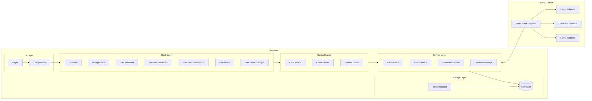
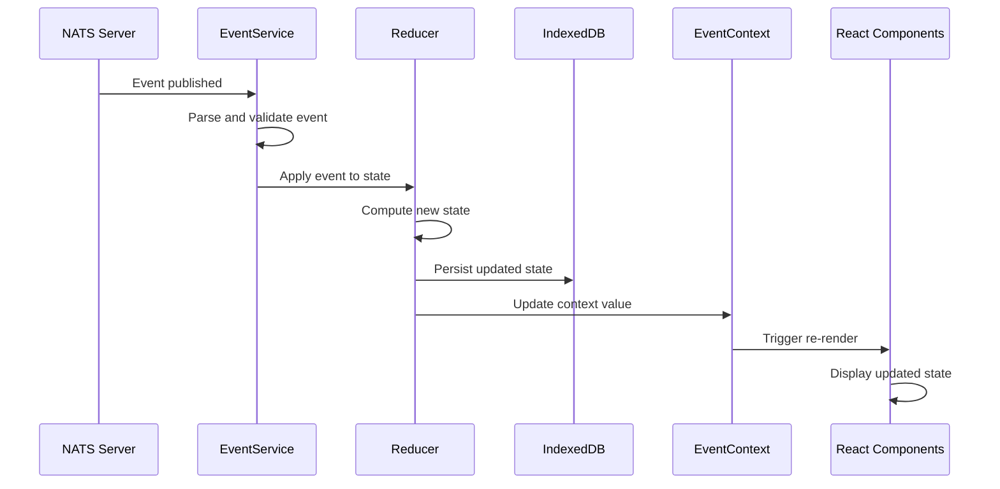
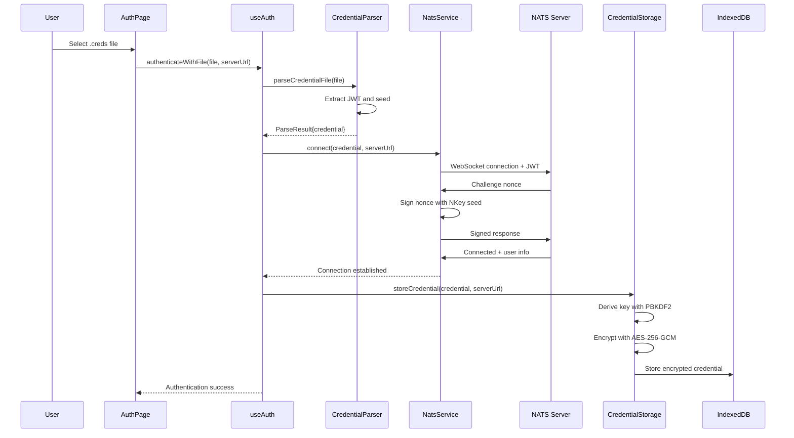
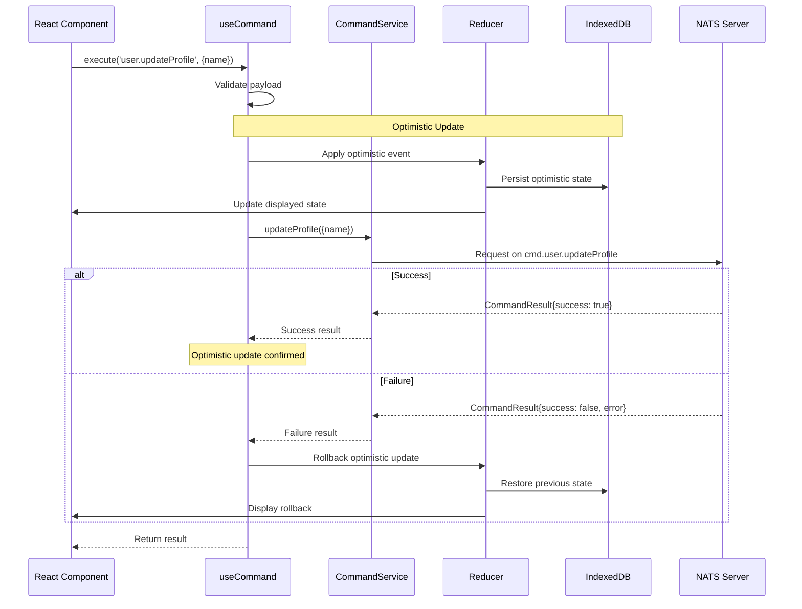
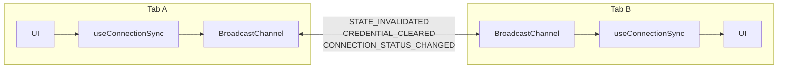

# Architecture Overview

This document describes the system architecture of the NATS UI Template, including component relationships, data flows, and key design decisions.

## System Architecture

The template follows a layered architecture where React components interact with NATS through a service layer, with state managed via a reducer pattern and persisted to IndexedDB.

## Component Overview

| Component | Layer | Purpose |
|-----------|-------|---------|
| **Pages** | UI | Route-level components (AuthPage, DashboardPage, SettingsPage) |
| **Components** | UI | Reusable UI elements (ConnectionStatus, CredentialUpload, etc.) |
| **useAuth** | Hooks | Authentication operations and credential lifecycle |
| **useAppState** | Hooks | Access to materialized application state |
| **useCommand** | Hooks | Execute commands with optimistic updates |
| **useNatsConnection** | Hooks | Connection state monitoring |
| **useEventSubscription** | Hooks | Subscribe to specific event types |
| **useTheme** | Hooks | Theme management (light/dark/system) |
| **useConnectionSync** | Hooks | Cross-tab synchronization |
| **AuthContext** | Contexts | Central authentication state management |
| **EventContext** | Contexts | Event-driven state container |
| **ThemeContext** | Contexts | Theme preferences storage |
| **NatsService** | Services | WebSocket connection management |
| **EventService** | Services | Event subscription handling |
| **CommandService** | Services | Request/reply command execution |
| **CredentialStorage** | Services | Encrypted credential persistence |
| **StateReducer** | Storage | Pure state reduction from events |
| **IndexedDB** | Storage | Persistent state and credential storage |

## Data Flow

### Event-Driven State Flow

All state updates flow through the reducer in response to NATS events. This ensures consistency and enables offline support through IndexedDB persistence.

### Authentication Flow

Authentication follows a challenge-response pattern for credential files, with encrypted storage for returning users.

### Command Execution Flow

Commands are executed via request/reply with optimistic updates for responsive UI.

### Cross-Tab Synchronization

Multiple browser tabs stay synchronized using the BroadcastChannel API.

**Sync Message Types:**

| Type | Trigger | Effect |
|------|---------|--------|
| `STATE_INVALIDATED` | State change in one tab | Other tabs reload state from IndexedDB |
| `CREDENTIAL_CLEARED` | User logs out | All tabs clear credentials and disconnect |
| `THEME_CHANGED` | Theme preference changed | All tabs update theme |
| `CONNECTION_STATUS_CHANGED` | Connection state change | Other tabs update their status display |

## NATS Subject Patterns

The template uses consistent subject patterns for events and commands.

### Events

Events are published to subjects following the pattern `{namespace}.events.{type}`:

| Subject Pattern | Event Type | Description |
|-----------------|------------|-------------|
| `{ns}.events.user.updated` | `user.updated` | User profile changed |
| `{ns}.events.session.created` | `session.created` | New session started |
| `{ns}.events.session.expired` | `session.expired` | Session terminated |
| `{ns}.events.notification.*` | `notification.*` | Notification events |

### Commands

Commands use request/reply on subjects following `{namespace}.cmd.{type}`:

| Subject Pattern | Command Type | Description |
|-----------------|--------------|-------------|
| `{ns}.cmd.user.updateProfile` | `user.updateProfile` | Update user profile |
| `{ns}.cmd.notification.dismiss` | `notification.dismiss` | Dismiss notification |
| `{ns}.cmd.notification.markRead` | `notification.markRead` | Mark as read |
| `{ns}.cmd.notification.markAllRead` | `notification.markAllRead` | Mark all as read |

### System Subjects

| Subject | Purpose |
|---------|---------|
| `$SYS.REQ.USER.INFO` | Fetch initial user/server info on connection |

## Storage Architecture

### IndexedDB Databases

| Database | Store | Contents |
|----------|-------|----------|
| `nats-credentials` | `credentials` | Encrypted credentials with PBKDF2 salt |
| `nats-state` | `state` | Materialized application state |

### Credential Encryption

Credentials are encrypted at rest using:
- **Algorithm**: AES-256-GCM
- **Key Derivation**: PBKDF2 with 100,000 iterations
- **Salt**: Randomly generated per credential
- **IV**: Randomly generated per encryption operation

## Design Decisions

### Why Event-Driven State?

1. **Real-time consistency** - All clients receive the same events and compute the same state
2. **Offline support** - Events can be replayed when reconnecting
3. **Audit trail** - Event history provides natural debugging and auditing
4. **Scalability** - NATS handles fan-out to many subscribers efficiently

### Why IndexedDB?

1. **Capacity** - Supports larger datasets than localStorage
2. **Async API** - Non-blocking operations for better performance
3. **Structured data** - Native support for objects without JSON serialization
4. **Transactions** - ACID guarantees for state consistency

### Why BroadcastChannel for Cross-Tab Sync?

1. **Same-origin only** - Security by design
2. **No server round-trip** - Direct tab-to-tab communication
3. **Simple API** - Easier than SharedWorker or ServiceWorker
4. **Wide support** - Available in all modern browsers

## Related Documentation

- [Project Structure](./project-structure.md) - File and directory organization
- [State Management Concepts](./concepts/state-management.md) - Deep dive into the reducer pattern
- [Authentication Concepts](./concepts/authentication.md) - Credential types and flows
- [Quick Reference](./quick-reference.md) - API reference for all components
