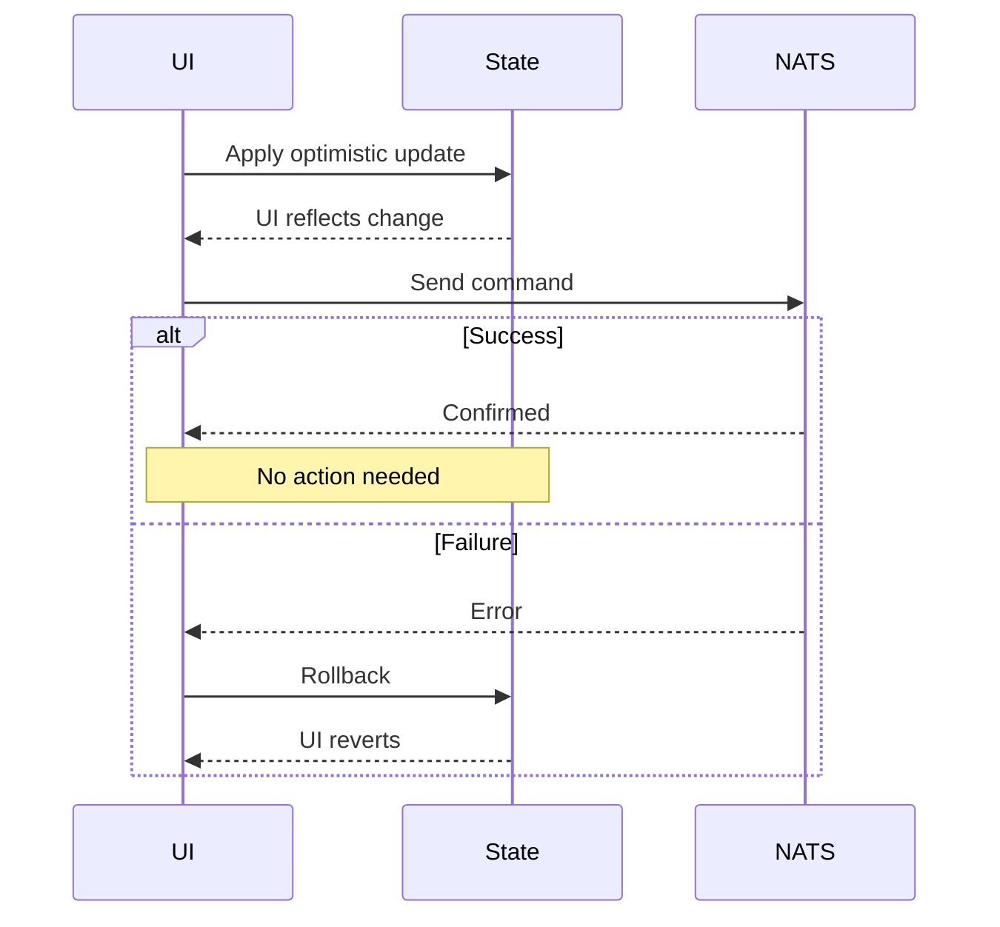
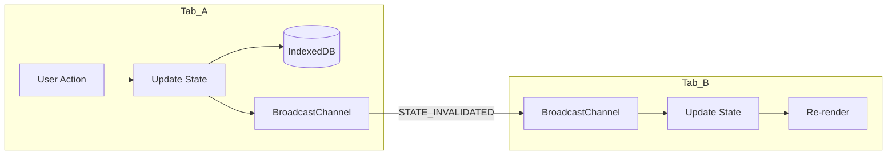

# State Management Best Practices

This guide covers best practices for event-driven state management, including optimistic updates, offline support, and performance optimization.

## Optimistic Updates

### The Pattern

Optimistic updates make the UI feel instant by updating state before the server confirms:

1. User takes action
2. State updates immediately (optimistic)
3. Command sent to server
4. On success: nothing (already updated)
5. On failure: rollback to previous state



### Implementation

The `useCommand` hook handles optimistic updates automatically:

```tsx
import { useCommand } from '@/hooks/useCommand';
import { useAppState } from '@/hooks/useAppState';

function ProfileEditor() {
  const { execute, isExecuting, error } = useCommand();
  const { user } = useAppState();

  const handleSave = async (name: string) => {
    // UI updates immediately when execute() is called
    const result = await execute('user.updateProfile', { name });

    if (!result.success) {
      // Rollback happened automatically
      // Show error to user
      showError(result.error.message);
    }
  };

  // user.name reflects optimistic value during execution
  return (
    <div>
      <p>Name: {user?.name}</p>
      <input
        defaultValue={user?.name}
        onBlur={(e) => handleSave(e.target.value)}
        disabled={isExecuting}
      />
    </div>
  );
}
```

### Custom Optimistic Updates

For complex scenarios, implement custom optimistic logic:

```typescript
import { getStateStorage } from '@/services/state/store';
import { appStateReducer } from '@/services/state/reducer';

async function optimisticUpdate<T>(
  command: () => Promise<T>,
  optimisticEvent: AppEvent,
): Promise<T> {
  const storage = getStateStorage();

  // 1. Save current state for rollback
  const previousState = await storage.getState();

  // 2. Apply optimistic update
  const optimisticState = appStateReducer(previousState, optimisticEvent);
  await storage.setState(optimisticState);

  try {
    // 3. Execute actual command
    return await command();
  } catch (error) {
    // 4. Rollback on failure
    await storage.setState(previousState);
    throw error;
  }
}

// Usage
const result = await optimisticUpdate(
  () => commandService.updateProfile({ name: 'New Name' }),
  {
    type: 'user.updated',
    timestamp: Date.now(),
    payload: { id: userId, changes: { name: 'New Name' } },
  }
);
```

## Offline Support

### Detecting Offline State

```tsx
import { useAppState } from '@/hooks/useAppState';

function DataDisplay() {
  const { syncStatus, isStale, user } = useAppState();

  // Show cached data when offline
  if (syncStatus === 'offline') {
    return (
      <div>
        <OfflineBanner />
        <UserCard user={user} />
      </div>
    );
  }

  // Warn about stale data
  if (isStale) {
    return (
      <div>
        <StaleBanner />
        <UserCard user={user} />
      </div>
    );
  }

  return <UserCard user={user} />;
}
```

### Disable Commands When Offline

```tsx
import { useCommand } from '@/hooks/useCommand';

function EditForm() {
  const { execute, canExecute, isExecuting } = useCommand();

  // canExecute is false when offline
  return (
    <button
      onClick={() => execute('user.updateProfile', { name })}
      disabled={!canExecute || isExecuting}
    >
      {!canExecute ? 'Offline' : isExecuting ? 'Saving...' : 'Save'}
    </button>
  );
}
```

### Queue Commands for Later (Advanced)

For offline-first applications, queue commands:

```typescript
interface QueuedCommand {
  id: string;
  type: CommandType;
  payload: CommandPayload;
  queuedAt: number;
}

class CommandQueue {
  private queue: QueuedCommand[] = [];
  private storage = localStorage;
  private key = 'command_queue';

  constructor() {
    this.load();
  }

  private load() {
    const data = this.storage.getItem(this.key);
    if (data) {
      this.queue = JSON.parse(data);
    }
  }

  private save() {
    this.storage.setItem(this.key, JSON.stringify(this.queue));
  }

  enqueue(type: CommandType, payload: CommandPayload) {
    this.queue.push({
      id: crypto.randomUUID(),
      type,
      payload,
      queuedAt: Date.now(),
    });
    this.save();
  }

  async flush(execute: typeof useCommand['execute']) {
    while (this.queue.length > 0) {
      const command = this.queue[0];
      const result = await execute(command.type, command.payload);

      if (result.success) {
        this.queue.shift();
        this.save();
      } else {
        // Stop on first failure
        break;
      }
    }
  }
}
```

## Cross-Tab Synchronization

### How It Works

State changes in one tab propagate to others via BroadcastChannel:



### Sync Message Types

| Message | Trigger | Effect |
|---------|---------|--------|
| `STATE_INVALIDATED` | State updated in one tab | Other tabs reload from IndexedDB |
| `CREDENTIAL_CLEARED` | User logs out | All tabs log out |
| `THEME_CHANGED` | Theme preference changed | All tabs update theme |
| `CONNECTION_STATUS_CHANGED` | Connection state changed | Update status indicators |

### Implementing Custom Sync

```typescript
import { useConnectionSync } from '@/hooks/useConnectionSync';

function App() {
  const { broadcastState } = useConnectionSync();

  // Custom sync after important operations
  const handleImportantAction = async () => {
    await doSomething();

    // Notify other tabs
    broadcastState('connected', true);
  };

  return <AppContent />;
}
```

### Handling Sync Conflicts

When tabs have different states:

```typescript
function handleStateConflict(localState: AppState, remoteState: AppState): AppState {
  // Use the most recent state
  if (remoteState.lastSyncedAt > localState.lastSyncedAt) {
    return remoteState;
  }

  // Or merge specific fields
  return {
    ...localState,
    notifications: {
      ...localState.notifications,
      ...remoteState.notifications,
    },
  };
}
```

## Performance Optimization

### Minimize Re-renders

#### 1. Use Selectors

Only subscribe to needed state:

```tsx
// DON'T DO THIS - re-renders on any state change
function Component() {
  const state = useAppState(); // Full state
  return <div>{state.user?.name}</div>;
}

// DO THIS - only re-renders when user changes
function Component() {
  const { user } = useAppState();
  return <div>{user?.name}</div>;
}
```

#### 2. Memoize Computed Values

```tsx
import { useMemo } from 'react';
import { useAppState } from '@/hooks/useAppState';

function NotificationList() {
  const { notifications } = useAppState();

  // Memoize filtering/sorting
  const unreadNotifications = useMemo(
    () => Object.values(notifications)
      .filter(n => !n.read && !n.dismissed)
      .sort((a, b) => b.createdAt - a.createdAt),
    [notifications]
  );

  return (
    <ul>
      {unreadNotifications.map(n => (
        <NotificationItem key={n.id} notification={n} />
      ))}
    </ul>
  );
}
```

#### 3. Use React.memo for Lists

```tsx
import { memo } from 'react';

const NotificationItem = memo(function NotificationItem({
  notification,
}: {
  notification: Notification;
}) {
  return (
    <li>
      <h3>{notification.title}</h3>
      <p>{notification.message}</p>
    </li>
  );
});
```

### Batch Updates

React 18+ automatically batches state updates, but be mindful:

```tsx
// These updates are batched automatically
const handleMultipleActions = async () => {
  await execute('notification.markRead', { notificationId: '1' });
  await execute('notification.markRead', { notificationId: '2' });
  await execute('notification.markRead', { notificationId: '3' });
  // React batches the re-renders
};

// For bulk operations, use batch command if available
const handleMarkAllRead = async () => {
  await execute('notification.markAllRead', {});
  // Single update, single re-render
};
```

### Debounce Rapid Updates

For inputs that trigger frequent updates:

```tsx
import { useDebouncedCallback } from 'use-debounce';
import { useCommand } from '@/hooks/useCommand';

function SearchInput() {
  const { execute } = useCommand();

  const debouncedSearch = useDebouncedCallback(
    (query: string) => execute('search.query', { query }),
    300 // 300ms delay
  );

  return (
    <input
      type="text"
      onChange={(e) => debouncedSearch(e.target.value)}
      placeholder="Search..."
    />
  );
}
```

## State Staleness

### When is State Stale?

State is considered stale when:
- No events received for 30+ seconds
- Connection is reconnecting
- Initial state fetch is old

```typescript
const STALE_THRESHOLD_MS = 30000; // 30 seconds

const isStale =
  syncStatus !== 'synced' ||
  Date.now() - lastSyncedAt > STALE_THRESHOLD_MS;
```

### Displaying Staleness

```tsx
import { useAppState } from '@/hooks/useAppState';

function StalenessIndicator() {
  const { isStale, syncStatus, refreshState } = useAppState();

  if (!isStale) return null;

  return (
    <div className="staleness-banner">
      {syncStatus === 'offline' ? (
        <span>Offline - showing cached data</span>
      ) : (
        <span>Data may be outdated</span>
      )}
      <button onClick={refreshState}>Refresh</button>
    </div>
  );
}
```

### Auto-Refresh on Reconnection

```tsx
import { useEffect, useRef } from 'react';
import { useAppState } from '@/hooks/useAppState';
import { useNatsConnection } from '@/hooks/useNatsConnection';

function AutoRefresh() {
  const { status } = useNatsConnection();
  const { refreshState, isStale } = useAppState();
  const prevStatus = useRef(status);

  useEffect(() => {
    // Refresh when reconnected
    if (prevStatus.current !== 'connected' && status === 'connected') {
      if (isStale) {
        refreshState();
      }
    }
    prevStatus.current = status;
  }, [status, isStale, refreshState]);

  return null;
}
```

## State Persistence

### IndexedDB Structure

The template stores state in IndexedDB:

```typescript
// Database: nats-state
// Store: state

interface PersistedState {
  id: 'current';
  data: AppState;
  updatedAt: number;
}
```

### Manual State Management

For advanced scenarios:

```typescript
import { getStateStorage } from '@/services/state/store';

async function exportState(): Promise<AppState> {
  const storage = getStateStorage();
  return storage.getState();
}

async function importState(state: AppState): Promise<void> {
  const storage = getStateStorage();
  await storage.setState(state);
}

async function clearState(): Promise<void> {
  const storage = getStateStorage();
  await storage.clearState();
}
```

## Best Practices Checklist

- [ ] Optimistic updates for user-initiated changes
- [ ] Rollback handling for failed operations
- [ ] Offline state detection and UI
- [ ] Disable commands when offline
- [ ] Cross-tab sync enabled
- [ ] Memoized computed values
- [ ] React.memo for list items
- [ ] Debounced rapid updates
- [ ] Staleness indicators
- [ ] Auto-refresh on reconnection

## Related Documentation

- [State Management Concepts](../concepts/state-management.md) - Event-driven architecture
- [Error Handling](./error-handling.md) - Handling failures
- [Quick Reference](../quick-reference.md) - Hook APIs
- [Architecture](../architecture.md) - System overview
