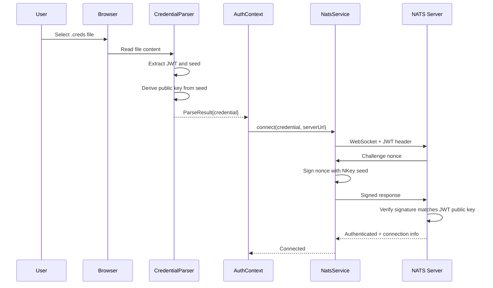
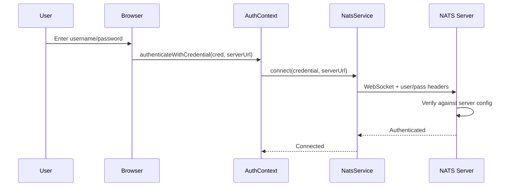
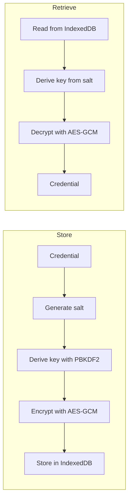
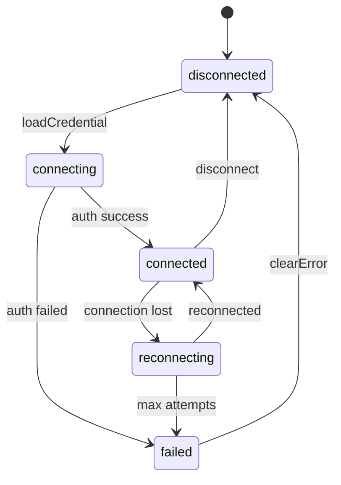

# Authentication

This guide explains authentication mechanisms in the NATS UI Template, including credential types, flows, and secure storage.

## Overview

NATS supports multiple authentication methods. This template implements two:

1. **Credential Files (.creds)** - JWT + NKey seed from a file
2. **Username/Password** - Traditional username and password

The authentication type is configured via the `VITE_AUTH_TYPE` environment variable.

## Credential Types

### Credential File (.creds)

A `.creds` file is generated by the NATS account management tool (`nsc`) and contains:

- **User JWT**: A signed token identifying the user and their permissions
- **NKey Seed**: A private key for signing challenge-response authentication

**File Format:**
```
-----BEGIN NATS USER JWT-----
eyJ0eXAiOiJKV1QiLCJhbGciOiJlZDI1NTE5LW5rZXkifQ.eyJqdGkiOiJHVEhK...
------END NATS USER JWT------

************************* IMPORTANT *************************
NKEY Seed printed below can be used to sign and prove identity.
NKEYs are sensitive and should be treated as secrets.

-----BEGIN USER NKEY SEED-----
SUAMK2...
------END USER NKEY SEED------

*************************************************************
```

**Type Definition:**
```typescript
interface CredsFileCredential {
  authType: "credsfile";
  id: string;
  loadedAt: number;
  source: "file" | "storage";
  jwt: string;
  seed: Uint8Array;
  publicKey: string;
}
```

### Username/Password

Simple username and password authentication, configured on the NATS server.

**Type Definition:**
```typescript
interface UserPassCredential {
  authType: "userpass";
  id: string;
  loadedAt: number;
  source: "form" | "storage";
  username: string;
  password: string;
}
```

## Authentication Flows

### Credential File Flow



### Username/Password Flow



## Using the useAuth Hook

The `useAuth` hook provides all authentication operations.

### Authenticate with Credential File

```tsx
import { useAuth } from '@/hooks/useAuth';

function CredentialUpload() {
  const {
    authenticateWithFile,
    isLoading,
    connectionError
  } = useAuth();

  const handleFileSelect = async (event: React.ChangeEvent<HTMLInputElement>) => {
    const file = event.target.files?.[0];
    if (!file) return;

    const serverUrl = import.meta.env.VITE_NATS_URL;
    const success = await authenticateWithFile(file, serverUrl);

    if (success) {
      console.log('Connected!');
    } else {
      console.error('Failed:', connectionError);
    }
  };

  return (
    <div>
      <input
        type="file"
        accept=".creds"
        onChange={handleFileSelect}
        disabled={isLoading}
      />
      {connectionError && (
        <p className="text-red-500">{connectionError.userMessage}</p>
      )}
    </div>
  );
}
```

### Authenticate with Username/Password

```tsx
import { useState } from 'react';
import { useAuth } from '@/hooks/useAuth';
import type { UserPassCredential } from '@/types';

function LoginForm() {
  const { authenticateWithCredential, isLoading, connectionError } = useAuth();
  const [username, setUsername] = useState('');
  const [password, setPassword] = useState('');

  const handleSubmit = async (e: React.FormEvent) => {
    e.preventDefault();

    const credential: UserPassCredential = {
      authType: 'userpass',
      id: crypto.randomUUID(),
      loadedAt: Date.now(),
      source: 'form',
      username,
      password,
    };

    const serverUrl = import.meta.env.VITE_NATS_URL;
    const success = await authenticateWithCredential(credential, serverUrl);

    if (!success) {
      console.error('Login failed:', connectionError);
    }
  };

  return (
    <form onSubmit={handleSubmit}>
      <input
        type="text"
        value={username}
        onChange={(e) => setUsername(e.target.value)}
        placeholder="Username"
      />
      <input
        type="password"
        value={password}
        onChange={(e) => setPassword(e.target.value)}
        placeholder="Password"
      />
      <button type="submit" disabled={isLoading}>
        {isLoading ? 'Connecting...' : 'Login'}
      </button>
      {connectionError && (
        <p className="text-red-500">{connectionError.userMessage}</p>
      )}
    </form>
  );
}
```

### Check Authentication Status

```tsx
import { useAuth } from '@/hooks/useAuth';

function AuthStatus() {
  const { isAuthenticated, connectionStatus, credential } = useAuth();

  return (
    <div>
      <p>Authenticated: {isAuthenticated ? 'Yes' : 'No'}</p>
      <p>Status: {connectionStatus}</p>
      {credential && (
        <p>Auth type: {credential.authType}</p>
      )}
    </div>
  );
}
```

### Disconnect

```tsx
import { useAuth } from '@/hooks/useAuth';

function LogoutButton() {
  const { disconnect, isAuthenticated } = useAuth();

  const handleLogout = async () => {
    // true = also clear stored credentials
    await disconnect(true);
  };

  if (!isAuthenticated) return null;

  return <button onClick={handleLogout}>Logout</button>;
}
```

### Auto-Authentication with Stored Credentials

```tsx
import { useEffect } from 'react';
import { useAuth } from '@/hooks/useAuth';

function AutoConnect() {
  const {
    authenticateWithStoredCredentials,
    hasStoredCredentials,
    setAuthCheckComplete,
    authCheckComplete,
  } = useAuth();

  useEffect(() => {
    const attemptAutoLogin = async () => {
      const hasStored = await hasStoredCredentials();
      if (hasStored) {
        await authenticateWithStoredCredentials();
      }
      setAuthCheckComplete();
    };

    if (!authCheckComplete) {
      attemptAutoLogin();
    }
  }, [authCheckComplete]);

  return null;
}
```

## Credential Storage

Credentials can be stored securely in IndexedDB for returning users.

### Encryption

Stored credentials are encrypted using:

| Property | Value |
|----------|-------|
| Algorithm | AES-256-GCM |
| Key Derivation | PBKDF2 |
| Iterations | 100,000 |
| Salt | Random per credential |
| IV | Random per encryption |

### Storage Structure

```typescript
interface StoredCredential {
  id: string;
  encrypted: string;      // Base64 IV + ciphertext
  salt: string;           // Base64 PBKDF2 salt
  iterations: number;
  storedAt: number;
  serverUrl: string;
  authType: AuthType;
}
```

### How It Works

1. **Store**: When user authenticates successfully, credential is encrypted and stored
2. **Retrieve**: On page load, encrypted credential is decrypted using device-derived key
3. **Clear**: On logout, encrypted data is removed from IndexedDB



### Security Considerations

1. **Seeds are sensitive**: The NKey seed can sign any message. Never log it.
2. **Device-specific encryption**: The encryption key is derived from device-specific factors.
3. **No server storage**: Credentials are never sent to a backend server.
4. **Automatic clearing**: On logout, stored credentials are wiped.

## NKey Challenge-Response

For `.creds` authentication, NATS uses NKey challenge-response:

1. **Client connects** with JWT in header
2. **Server sends nonce** (random challenge)
3. **Client signs nonce** with NKey seed
4. **Server verifies** signature matches JWT's public key

This proves the client possesses the private key without transmitting it.

```typescript
// Simplified - the actual signing happens in @nats-io/nkeys
import { fromSeed } from '@nats-io/nkeys';

// The seed is stored as Uint8Array
const keyPair = fromSeed(credential.seed);

// Sign the server's nonce
const signature = keyPair.sign(nonce);

// Server verifies using public key from JWT
const valid = verify(signature, nonce, publicKeyFromJWT);
```

## Connection Statuses

The template tracks connection state:

```typescript
type ConnectionStatus =
  | "disconnected"  // No connection, no credential
  | "connecting"    // Attempting to connect
  | "connected"     // Active connection
  | "reconnecting"  // Lost connection, attempting restore
  | "failed";       // Connection failed, user action needed
```

### Status Transitions



## Error Codes

Authentication errors include:

| Code | Description |
|------|-------------|
| `INVALID_CREDENTIAL` | Credential file format error |
| `AUTH_FAILED` | Server rejected authentication |
| `CONNECTION_REFUSED` | Server unreachable |
| `CONNECTION_TIMEOUT` | Connection timed out |
| `PERMISSION_DENIED` | User lacks permissions |

Each error includes:
- `code`: Machine-readable error code
- `message`: Technical error message
- `userMessage`: UI-friendly message
- `recoverable`: Whether auto-retry is possible

## Related Documentation

- [NATS Fundamentals](./nats-fundamentals.md) - Basic NATS concepts
- [Security Best Practices](../best-practices/security.md) - Secure credential handling
- [Troubleshooting](../troubleshooting.md) - Authentication error solutions
- [Quick Reference](../quick-reference.md) - useAuth API reference
