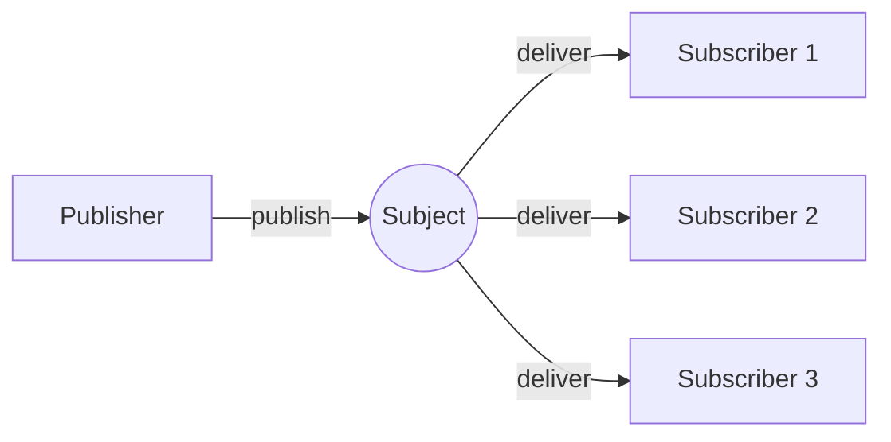
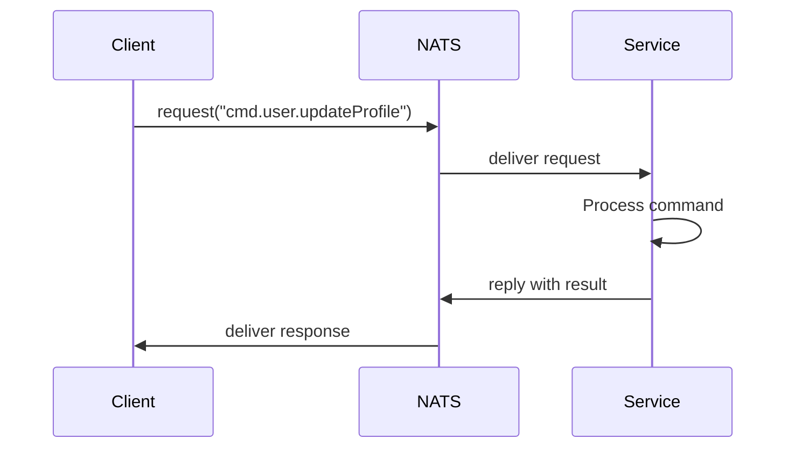
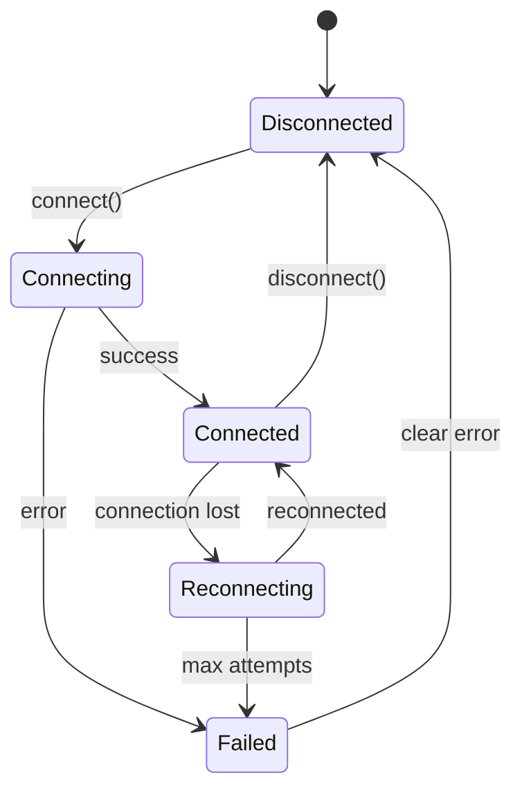

# NATS Fundamentals

This guide introduces NATS messaging concepts for developers new to NATS or event-driven architectures.

## What is NATS?

NATS is a lightweight, high-performance messaging system. Unlike traditional request/response APIs (REST, GraphQL), NATS uses a publish/subscribe model where:

- **Publishers** send messages to **subjects** (like topics or channels)
- **Subscribers** listen to subjects and receive messages
- The NATS server routes messages between publishers and subscribers

NATS is not a database. It's a message broker that enables real-time communication between services, applications, and users.

## Why NATS for Web Applications?

Traditional web applications use HTTP for everything: fetching data, submitting forms, checking for updates. This model has limitations:

| Traditional (HTTP) | NATS-Native |
|-------------------|-------------|
| Request/response only | Pub/sub + request/reply |
| Polling for updates | Push-based events |
| Point-to-point | Fan-out to many subscribers |
| Stateless connections | Persistent WebSocket |

With NATS, your browser maintains a WebSocket connection to the server. When something changes, the server pushes an event immediately to all connected clients. No polling required.

## Publish/Subscribe

The most basic NATS pattern. A publisher sends a message; any number of subscribers receive it.



### Publishing a Message

```typescript
import { useNatsConnection } from '@/hooks/useNatsConnection';
import { StringCodec } from '@nats-io/nats-core';

function PublishExample() {
  const { getConnection } = useNatsConnection();
  const sc = StringCodec();

  const publish = async () => {
    const conn = getConnection();
    if (!conn) return;

    // Publish a message to the "app.events.user.updated" subject
    conn.publish(
      'app.events.user.updated',
      sc.encode(JSON.stringify({
        type: 'user.updated',
        timestamp: Date.now(),
        payload: { id: '123', changes: { name: 'New Name' } }
      }))
    );
  };

  return <button onClick={publish}>Publish Event</button>;
}
```

### Subscribing to Messages

```typescript
import { useEffect } from 'react';
import { useNatsConnection } from '@/hooks/useNatsConnection';
import { StringCodec } from '@nats-io/nats-core';

function SubscribeExample() {
  const { getConnection } = useNatsConnection();
  const sc = StringCodec();

  useEffect(() => {
    const conn = getConnection();
    if (!conn) return;

    // Subscribe to all user events
    const sub = conn.subscribe('app.events.user.>');

    (async () => {
      for await (const msg of sub) {
        const data = JSON.parse(sc.decode(msg.data));
        console.log('Received event:', data);
      }
    })();

    return () => {
      sub.unsubscribe();
    };
  }, [getConnection]);

  return <div>Listening for events...</div>;
}
```

**Note**: The template provides `useEventSubscription` hook which handles this boilerplate for you.

## Request/Reply

For operations that need a response (like commands), NATS supports request/reply.



### Making a Request

```typescript
import { useNatsConnection } from '@/hooks/useNatsConnection';
import { StringCodec } from '@nats-io/nats-core';

function RequestExample() {
  const { getConnection } = useNatsConnection();
  const sc = StringCodec();

  const updateProfile = async () => {
    const conn = getConnection();
    if (!conn) return;

    try {
      // Send request and wait for response
      const response = await conn.request(
        'app.cmd.user.updateProfile',
        sc.encode(JSON.stringify({
          id: crypto.randomUUID(),
          type: 'user.updateProfile',
          timestamp: Date.now(),
          payload: { name: 'New Name' }
        })),
        { timeout: 3000 } // 3 second timeout
      );

      const result = JSON.parse(sc.decode(response.data));
      console.log('Command result:', result);
    } catch (error) {
      console.error('Request failed:', error);
    }
  };

  return <button onClick={updateProfile}>Update Profile</button>;
}
```

**Note**: The template provides `useCommand` hook which handles commands with optimistic updates and error handling.

## Subject Naming

Subjects in NATS are strings with dot-separated tokens. The template follows these conventions:

### Event Subjects

Pattern: `{namespace}.events.{entity}.{action}`

| Subject | Description |
|---------|-------------|
| `app.events.user.updated` | User profile changed |
| `app.events.session.created` | New session started |
| `app.events.notification.received` | New notification |

### Command Subjects

Pattern: `{namespace}.cmd.{entity}.{action}`

| Subject | Description |
|---------|-------------|
| `app.cmd.user.updateProfile` | Update user profile |
| `app.cmd.notification.dismiss` | Dismiss a notification |
| `app.cmd.notification.markRead` | Mark notification as read |

### Wildcards

NATS supports two wildcards for subscriptions:

| Wildcard | Meaning | Example |
|----------|---------|---------|
| `*` | Match one token | `app.events.*.updated` matches `app.events.user.updated` |
| `>` | Match one or more tokens | `app.events.>` matches all events |

```typescript
// Subscribe to all notification events
conn.subscribe('app.events.notification.>');

// Subscribe to all "updated" events for any entity
conn.subscribe('app.events.*.updated');
```

## WebSocket Transport

In browsers, NATS uses WebSocket connections. This is transparent to your code—the same NATS API works regardless of transport.

### Connection URL Formats

| Environment | URL Format | Example |
|-------------|------------|---------|
| Local dev | `ws://host:port` | `ws://localhost:4222` |
| Production | `wss://host:port` | `wss://nats.example.com:443` |

**Always use `wss://` in production** for encrypted connections.

### Connection Lifecycle



The template handles reconnection automatically with exponential backoff.

## Comparison with REST

| Aspect | REST API | NATS Messaging |
|--------|----------|----------------|
| **Getting data** | `GET /users/123` | Subscribe to `users.123.>` |
| **Updating data** | `PUT /users/123` | Request to `cmd.users.update` |
| **Real-time updates** | Poll or WebSocket wrapper | Native pub/sub |
| **Broadcast to all clients** | Not built-in | Publish to subject |
| **Connection** | New per request | Persistent WebSocket |

## When to Use Each Pattern

### Publish/Subscribe

Use for:
- Broadcasting state changes to all clients
- Notifications and alerts
- Real-time updates
- Audit logging

### Request/Reply

Use for:
- Commands that need confirmation
- Data mutations
- Operations that return a result
- Anything that needs to "wait" for completion

## Template Integration

The NATS UI Template abstracts these patterns into React hooks:

| Hook | Pattern | Use Case |
|------|---------|----------|
| `useEventSubscription` | Pub/Sub | React to specific events |
| `useCommand` | Request/Reply | Execute commands |
| `useAppState` | Both | Access materialized state |
| `useNatsConnection` | N/A | Raw connection access |

### Example: Using Template Hooks

Instead of raw NATS operations, use the template's hooks:

```tsx
import { useEventSubscription } from '@/hooks/useEventSubscription';
import { useCommand } from '@/hooks/useCommand';
import { useAppState } from '@/hooks/useAppState';

function ProfileComponent() {
  const { user } = useAppState();
  const { execute, isExecuting } = useCommand();

  // Subscribe to user updates (handled for you)
  useEventSubscription('user.updated', (event) => {
    console.log('User updated:', event.payload);
  });

  const handleSave = async (name: string) => {
    const result = await execute('user.updateProfile', { name });
    if (!result.success) {
      console.error('Failed:', result.error);
    }
  };

  return (
    <div>
      <h1>{user?.name}</h1>
      <button onClick={() => handleSave('New Name')} disabled={isExecuting}>
        Update Name
      </button>
    </div>
  );
}
```

## Related Documentation

- [Authentication](./authentication.md) - How to authenticate with NATS
- [State Management](./state-management.md) - Event-driven state patterns
- [Quick Reference](../quick-reference.md) - API reference for hooks and types
- [Architecture](../architecture.md) - System component overview
