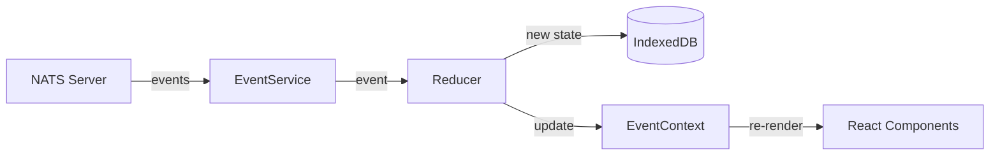
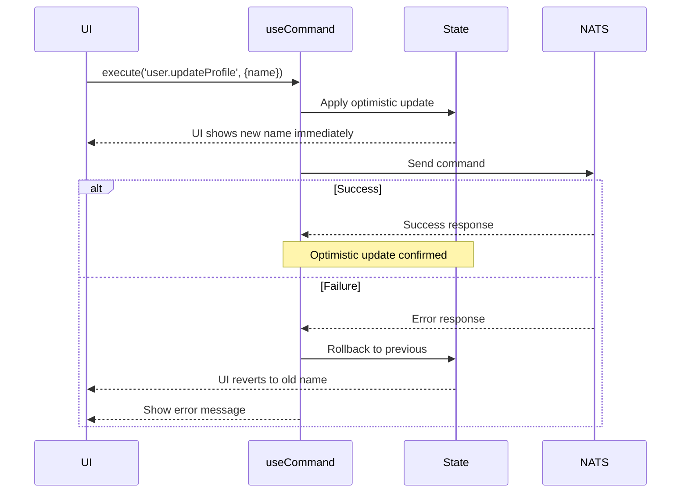
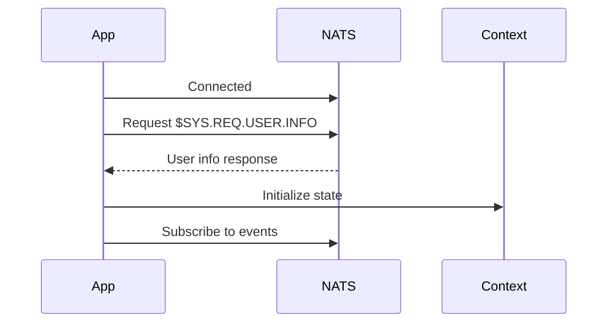

# Event-Driven State Management

This guide explains how the NATS UI Template manages application state through events, including the reducer pattern, optimistic updates, and offline support.

## Event-Driven Architecture

Instead of fetching data and manually updating state, this template uses an event-driven approach:

1. **Events** arrive via NATS subscription
2. **Reducer** transforms events into state updates
3. **IndexedDB** persists state for offline access
4. **React Context** notifies components to re-render



This approach provides:
- **Consistency**: All clients compute the same state from the same events
- **Real-time updates**: State changes push instantly
- **Offline support**: State persists in IndexedDB
- **Audit trail**: Event history shows what happened and when

## Event Types

The template defines these event types:

```typescript
// User events
interface UserUpdatedEvent {
  type: "user.updated";
  timestamp: number;
  payload: {
    id: string;
    changes: Partial<User>;
  };
}

// Session events
interface SessionCreatedEvent {
  type: "session.created";
  timestamp: number;
  payload: Session;
}

interface SessionExpiredEvent {
  type: "session.expired";
  timestamp: number;
  payload: {
    sessionId: string;
    reason: "timeout" | "logout" | "revoked";
  };
}

// Notification events
interface NotificationReceivedEvent {
  type: "notification.received";
  timestamp: number;
  payload: Notification;
}

interface NotificationReadEvent {
  type: "notification.read";
  timestamp: number;
  payload: { notificationId: string };
}

interface NotificationDismissedEvent {
  type: "notification.dismissed";
  timestamp: number;
  payload: { notificationId: string };
}

// Union of all events
type AppEvent =
  | UserUpdatedEvent
  | SessionCreatedEvent
  | SessionExpiredEvent
  | NotificationReceivedEvent
  | NotificationReadEvent
  | NotificationDismissedEvent;
```

## Application State

The state shape managed by the reducer:

```typescript
interface AppState {
  user: User | null;
  sessions: Record<string, Session>;
  notifications: Record<string, Notification>;
  lastSyncedAt: number;
  syncStatus: SyncStatus;
}

type SyncStatus = "synced" | "syncing" | "stale" | "offline";
```

## The Reducer Pattern

The state reducer is a pure function that applies events to produce new state:

```typescript
function appStateReducer(state: AppState, event: AppEvent): AppState {
  switch (event.type) {
    case "user.updated":
      return {
        ...state,
        user: state.user ? {
          ...state.user,
          ...event.payload.changes,
          updatedAt: event.timestamp,
        } : null,
        lastSyncedAt: event.timestamp,
      };

    case "session.created":
      return {
        ...state,
        sessions: {
          ...state.sessions,
          [event.payload.id]: event.payload,
        },
        lastSyncedAt: event.timestamp,
      };

    case "session.expired":
      const { [event.payload.sessionId]: _, ...remainingSessions } = state.sessions;
      return {
        ...state,
        sessions: remainingSessions,
        lastSyncedAt: event.timestamp,
      };

    case "notification.received":
      return {
        ...state,
        notifications: {
          ...state.notifications,
          [event.payload.id]: event.payload,
        },
        lastSyncedAt: event.timestamp,
      };

    case "notification.read":
      const notif = state.notifications[event.payload.notificationId];
      if (!notif) return state;
      return {
        ...state,
        notifications: {
          ...state.notifications,
          [event.payload.notificationId]: { ...notif, read: true },
        },
        lastSyncedAt: event.timestamp,
      };

    case "notification.dismissed":
      const n = state.notifications[event.payload.notificationId];
      if (!n) return state;
      return {
        ...state,
        notifications: {
          ...state.notifications,
          [event.payload.notificationId]: { ...n, dismissed: true },
        },
        lastSyncedAt: event.timestamp,
      };

    default:
      return state;
  }
}
```

**Key Principles:**
- **Pure function**: No side effects, same inputs always produce same outputs
- **Immutable updates**: Never mutate state, always return new objects
- **Complete coverage**: Handle all event types

## Using useAppState

The `useAppState` hook provides access to the materialized state:

```tsx
import { useAppState } from '@/hooks/useAppState';

function Dashboard() {
  const {
    user,
    notifications,
    sessions,
    syncStatus,
    isLoading,
    isStale,
    unreadNotificationCount,
    notificationList,
    refreshState,
  } = useAppState();

  if (isLoading) {
    return <LoadingSpinner />;
  }

  return (
    <div>
      {isStale && <StalenessWarning />}

      <h1>Welcome, {user?.name}</h1>

      <div>
        <h2>Notifications ({unreadNotificationCount} unread)</h2>
        <ul>
          {notificationList.map(n => (
            <li key={n.id} className={n.read ? 'read' : 'unread'}>
              {n.title}
            </li>
          ))}
        </ul>
      </div>

      <button onClick={refreshState}>Refresh</button>
    </div>
  );
}
```

### Available Properties

| Property | Type | Description |
|----------|------|-------------|
| `user` | `User \| null` | Current user data |
| `sessions` | `Record<string, Session>` | All sessions indexed by ID |
| `notifications` | `Record<string, Notification>` | All notifications indexed by ID |
| `syncStatus` | `SyncStatus` | Current sync state |
| `lastSyncedAt` | `number` | Timestamp of last sync |
| `isLoading` | `boolean` | True during initial load |
| `hasError` | `boolean` | True if load failed |
| `error` | `string \| null` | Error message if any |
| `isStale` | `boolean` | True if data may be outdated |
| `unreadNotificationCount` | `number` | Count of unread notifications |
| `activeSessionCount` | `number` | Count of non-expired sessions |
| `notificationList` | `Notification[]` | Sorted list (newest first) |
| `activeSessionList` | `Session[]` | Sorted list of active sessions |
| `refreshState` | `() => Promise<void>` | Manually refresh state |

## Subscribing to Events

Use `useEventSubscription` to react to specific events:

```tsx
import { useEventSubscription } from '@/hooks/useEventSubscription';

function NotificationToast() {
  // React to new notifications
  useEventSubscription('notification.received', (event) => {
    showToast({
      title: event.payload.title,
      message: event.payload.message,
      type: event.payload.type,
    });
  });

  return null;
}

function SessionMonitor() {
  // React to session expiration
  useEventSubscription('session.expired', (event) => {
    if (event.payload.reason === 'revoked') {
      showAlert('Your session was terminated by an administrator');
    }
  });

  return null;
}
```

### Multiple Event Types

```tsx
import { useEventSubscriptions } from '@/hooks/useEventSubscription';

function EventLogger() {
  useEventSubscriptions({
    'user.updated': (event) => {
      console.log('User updated:', event.payload.changes);
    },
    'notification.received': (event) => {
      console.log('New notification:', event.payload.title);
    },
    'session.expired': (event) => {
      console.log('Session expired:', event.payload.reason);
    },
  });

  return null;
}
```

## Executing Commands

Use `useCommand` to execute commands with optimistic updates:

```tsx
import { useCommand } from '@/hooks/useCommand';

function ProfileEditor() {
  const { execute, isExecuting, error, canExecute, clearError } = useCommand();

  const handleSave = async (name: string) => {
    const result = await execute('user.updateProfile', { name });

    if (result.success) {
      // State already updated optimistically!
      console.log('Profile updated');
    } else {
      // Optimistic update was rolled back
      console.error('Failed:', result.error.message);
    }
  };

  return (
    <form onSubmit={(e) => {
      e.preventDefault();
      handleSave(e.target.name.value);
    }}>
      {error && (
        <div className="error">
          {error}
          <button onClick={clearError}>Dismiss</button>
        </div>
      )}
      <input name="name" />
      <button disabled={!canExecute || isExecuting}>
        {isExecuting ? 'Saving...' : 'Save'}
      </button>
    </form>
  );
}
```

### Command Types

| Command | Payload | Description |
|---------|---------|-------------|
| `user.updateProfile` | `{ name?: string, avatarUrl?: string }` | Update user profile |
| `notification.dismiss` | `{ notificationId: string }` | Dismiss notification |
| `notification.markRead` | `{ notificationId: string }` | Mark as read |
| `notification.markAllRead` | `{}` | Mark all as read |

## Optimistic Updates

The template implements optimistic updates for responsive UI:



### How It Works

1. **User action**: User clicks "Save"
2. **Optimistic update**: State immediately reflects the change
3. **Command sent**: Request sent to NATS
4. **Success**: Optimistic update confirmed (no additional action)
5. **Failure**: State rolled back, error shown

```typescript
// Simplified optimistic update flow
async function execute(type, payload) {
  // 1. Save current state for potential rollback
  const previousState = await storage.getState();

  // 2. Apply optimistic update
  const optimisticState = applyOptimistic(previousState, type, payload);
  await storage.setState(optimisticState);

  // 3. Send command
  try {
    const result = await commandService.execute(type, payload);

    if (!result.success) {
      // 4a. Rollback on failure
      await storage.setState(previousState);
      return result;
    }

    // 4b. Success - optimistic update was correct
    return result;
  } catch (error) {
    // Rollback on error
    await storage.setState(previousState);
    throw error;
  }
}
```

## Offline Support

State persists in IndexedDB, enabling offline access:

### Reading Offline

When disconnected, components still render from cached state:

```tsx
function Dashboard() {
  const { user, syncStatus, isStale } = useAppState();

  return (
    <div>
      {syncStatus === 'offline' && (
        <Banner>You're offline. Showing cached data.</Banner>
      )}
      {isStale && (
        <Banner>Data may be outdated.</Banner>
      )}
      <h1>Welcome, {user?.name}</h1>
    </div>
  );
}
```

### Staleness Detection

The template tracks when data was last synced:

```typescript
const STALE_THRESHOLD_MS = 30000; // 30 seconds

const isStale = syncStatus !== 'synced' ||
  (Date.now() - lastSyncedAt > STALE_THRESHOLD_MS);
```

### Command Restrictions

Commands require an active connection:

```tsx
const { canExecute } = useCommand();

// canExecute is false when:
// - Not connected to NATS
// - syncStatus is "offline"
```

## Initial State Fetch

On connection, the template fetches initial state from `$SYS.REQ.USER.INFO`:



The response populates initial user data:

```typescript
interface GetStateResponse {
  user: User;
  sessions: Session[];
  notifications: Notification[];
  serverTime: number;
}
```

## Cross-Tab Sync

State changes propagate to other browser tabs via BroadcastChannel:

```tsx
import { useConnectionSync } from '@/hooks/useConnectionSync';

function App() {
  // Automatically syncs connection state across tabs
  useConnectionSync();

  return <AppContent />;
}
```

### Sync Messages

| Message Type | Trigger | Effect |
|--------------|---------|--------|
| `STATE_INVALIDATED` | State change | Other tabs reload from IndexedDB |
| `CREDENTIAL_CLEARED` | Logout | All tabs log out |
| `THEME_CHANGED` | Theme change | All tabs update theme |
| `CONNECTION_STATUS_CHANGED` | Connect/disconnect | Update status displays |

## Adding New Event Types

To add a new event type:

1. **Define the event interface** in `types/events.ts`:
   ```typescript
   interface TaskCompletedEvent extends BaseEvent {
     type: "task.completed";
     payload: { taskId: string; completedAt: number };
   }

   // Add to AppEvent union
   type AppEvent = ... | TaskCompletedEvent;
   ```

2. **Add type guard**:
   ```typescript
   export function isTaskCompletedEvent(event: AppEvent): event is TaskCompletedEvent {
     return event.type === "task.completed";
   }
   ```

3. **Update the reducer** in `services/state/reducer.ts`:
   ```typescript
   case "task.completed":
     return {
       ...state,
       tasks: {
         ...state.tasks,
         [event.payload.taskId]: {
           ...state.tasks[event.payload.taskId],
           completed: true,
           completedAt: event.payload.completedAt,
         },
       },
     };
   ```

4. **Update AppState type** in `types/state.ts` if needed.

## Related Documentation

- [NATS Fundamentals](./nats-fundamentals.md) - Messaging patterns
- [Architecture](../architecture.md) - System overview
- [Quick Reference](../quick-reference.md) - Hook API reference
- [Best Practices: State Management](../best-practices/state-management.md) - Advanced patterns
