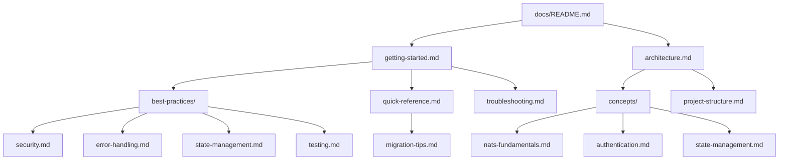

# Data Model: Developer Documentation

**Feature**: 001-developer-docs
**Date**: 2026-01-20

## Overview

This document defines the structure and entities for the developer documentation. Since this is a documentation feature (not a data-driven feature), the "data model" describes the documentation artifacts, their relationships, and content requirements.

---

## Entity Definitions

### DocumentationFile

Represents a single markdown documentation file.

| Field | Type | Required | Description |
|-------|------|----------|-------------|
| path | string | Yes | Relative path from repo root (e.g., `docs/getting-started.md`) |
| title | string | Yes | Document title (H1 heading) |
| functionalReqs | string[] | Yes | Functional requirements covered (e.g., `["FR-001", "FR-003"]`) |
| sections | Section[] | Yes | Ordered list of sections within the document |
| crossRefs | string[] | No | Paths to related documents |

### Section

Represents a logical section within a documentation file.

| Field | Type | Required | Description |
|-------|------|----------|-------------|
| heading | string | Yes | Section heading (H2 or H3) |
| contentType | ContentType | Yes | Type of content in this section |
| codeExamples | CodeExample[] | No | Runnable code examples |
| diagrams | Diagram[] | No | Mermaid diagrams |
| successCriteria | string[] | No | Success criteria this section addresses |

### ContentType

Enumeration of section content types.

```typescript
type ContentType =
  | "prose"           // Explanatory text
  | "tutorial"        // Step-by-step instructions
  | "reference"       // API/type documentation
  | "troubleshooting" // Problem/solution pairs
  | "checklist"       // Action items
```

### CodeExample

Represents a code snippet with context.

| Field | Type | Required | Description |
|-------|------|----------|-------------|
| language | string | Yes | Code fence language (e.g., `typescript`, `tsx`, `bash`) |
| code | string | Yes | The code snippet |
| description | string | Yes | What this example demonstrates |
| runnable | boolean | Yes | Whether example is copy-paste runnable |
| imports | string[] | No | Required imports for runnable examples |

### Diagram

Represents a Mermaid diagram.

| Field | Type | Required | Description |
|-------|------|----------|-------------|
| type | DiagramType | Yes | Mermaid diagram type |
| code | string | Yes | Mermaid diagram definition |
| caption | string | Yes | Description of what diagram shows |

```typescript
type DiagramType = "flowchart" | "sequenceDiagram" | "classDiagram" | "graph"
```

---

## Documentation File Specifications

### 1. docs/README.md

**Title**: NATS UI Template Documentation
**Functional Requirements**: FR-001
**Success Criteria**: SC-001

| Section | Content Type | Description |
|---------|--------------|-------------|
| What is this template? | prose | Purpose, value proposition |
| Key Features | prose | Feature highlights with bullet points |
| Target Audience | prose | Who should use this template |
| Prerequisites | checklist | Requirements before getting started |
| Quick Links | reference | Navigation to other docs |

---

### 2. docs/architecture.md

**Title**: Architecture Overview
**Functional Requirements**: FR-001, FR-010
**Success Criteria**: SC-001

| Section | Content Type | Diagrams |
|---------|--------------|----------|
| System Architecture | prose | High-level component flowchart |
| Component Overview | prose | Table of major components |
| Data Flow | prose | Event-driven state sequence diagram |
| Authentication Flow | prose | Auth sequence diagram |
| Cross-Tab Synchronization | prose | BroadcastChannel flowchart |

**Required Diagrams**:
1. System architecture (Browser ↔ NATS ↔ Events/Commands)
2. Event-driven state flow (Event → Reducer → Store → React)
3. Authentication sequence (Load → Parse → Connect → Authenticate)
4. Cross-tab sync flow (Tab A → Channel → Tab B)

---

### 3. docs/concepts/nats-fundamentals.md

**Title**: NATS Fundamentals
**Functional Requirements**: FR-002
**Success Criteria**: SC-001

| Section | Content Type | Code Examples |
|---------|--------------|---------------|
| What is NATS? | prose | None |
| Publish/Subscribe | prose + tutorial | Basic pub/sub example |
| Request/Reply | prose + tutorial | Request pattern example |
| Subject Naming | reference | Subject pattern examples |
| WebSocket Transport | prose | Connection URL format |

---

### 4. docs/concepts/authentication.md

**Title**: Authentication
**Functional Requirements**: FR-002
**Success Criteria**: SC-001

| Section | Content Type | Code Examples |
|---------|--------------|---------------|
| Overview | prose | None |
| Credential Types | reference | Type definitions |
| Credential Files (.creds) | tutorial | File format example |
| Username/Password | tutorial | UserPass usage |
| NKey Authentication | prose | How challenge-response works |
| Credential Storage | prose | Encryption overview |

---

### 5. docs/concepts/state-management.md

**Title**: Event-Driven State Management
**Functional Requirements**: FR-002
**Success Criteria**: SC-001

| Section | Content Type | Diagrams |
|---------|--------------|----------|
| Event-Driven Architecture | prose | Event flow diagram |
| Event Types | reference | Event type table |
| State Reducer | prose + reference | Reducer pattern example |
| Optimistic Updates | tutorial | Command with optimistic update |
| Offline Support | prose | IndexedDB persistence |

---

### 6. docs/getting-started.md

**Title**: Getting Started
**Functional Requirements**: FR-003
**Success Criteria**: SC-002, SC-003

| Section | Content Type | Code Examples |
|---------|--------------|---------------|
| Prerequisites | checklist | Version check commands |
| Clone Repository | tutorial | git clone command |
| Install Dependencies | tutorial | npm install command |
| Configure Environment | tutorial | .env setup |
| Start NATS Server | tutorial | Docker command |
| Run Development Server | tutorial | npm run dev |
| Verify Setup | tutorial | Expected results |

**Time Constraint**: Complete within 30 minutes.

---

### 7. docs/project-structure.md

**Title**: Project Structure
**Functional Requirements**: FR-007
**Success Criteria**: SC-004

| Section | Content Type | Description |
|---------|--------------|-------------|
| Directory Overview | reference | Tree structure with descriptions |
| Source Code Layout | reference | src/ organization |
| Component Organization | reference | Component naming conventions |
| Service Layer | reference | services/ structure |
| Type Definitions | reference | types/ organization |
| Configuration Files | reference | Config file purposes |

---

### 8. docs/best-practices/security.md

**Title**: Security Best Practices
**Functional Requirements**: FR-004
**Success Criteria**: SC-006

| Section | Content Type | Code Examples |
|---------|--------------|---------------|
| Credential Handling | tutorial | Secure storage pattern |
| Encrypted Connections | prose | WSS configuration |
| Content Security Policy | reference | CSP header example |
| Input Sanitization | tutorial | Subject sanitization |
| Error Message Safety | prose | Avoiding credential leaks |

---

### 9. docs/best-practices/error-handling.md

**Title**: Error Handling Best Practices
**Functional Requirements**: FR-004
**Success Criteria**: SC-006

| Section | Content Type | Code Examples |
|---------|--------------|---------------|
| Connection Errors | reference + tutorial | Error code handling |
| Command Errors | reference + tutorial | Command failure handling |
| User Feedback | tutorial | Toast/alert patterns |
| Retry Strategies | prose | Recoverable vs non-recoverable |
| Logging | prose | Safe logging practices |

---

### 10. docs/best-practices/state-management.md

**Title**: State Management Best Practices
**Functional Requirements**: FR-004

| Section | Content Type | Code Examples |
|---------|--------------|---------------|
| Optimistic Updates | tutorial | Command optimistic pattern |
| Offline Support | tutorial | Offline detection |
| State Staleness | prose | Stale data handling |
| Cross-Tab Sync | reference | BroadcastChannel usage |
| Performance | prose | Minimizing re-renders |

---

### 11. docs/best-practices/testing.md

**Title**: Testing Best Practices
**Functional Requirements**: FR-004

| Section | Content Type | Code Examples |
|---------|--------------|---------------|
| Testing Strategy | prose | Unit/integration split |
| Component Tests | tutorial | React Testing Library example |
| Hook Tests | tutorial | Custom hook test example |
| Service Tests | tutorial | Mocking NatsService |
| Integration Tests | tutorial | Full flow test example |

---

### 12. docs/quick-reference.md

**Title**: Quick Reference
**Functional Requirements**: FR-006
**Success Criteria**: SC-004

| Section | Content Type | Description |
|---------|--------------|-------------|
| Hooks API | reference | All hooks with signatures |
| Contexts API | reference | All contexts with values |
| Type Definitions | reference | Core types quick lookup |
| Event Types | reference | Event type table |
| Command Types | reference | Command type table |
| Subject Patterns | reference | NATS subject patterns |
| Configuration | reference | Environment variables |

---

### 13. docs/troubleshooting.md

**Title**: Troubleshooting
**Functional Requirements**: FR-008
**Success Criteria**: SC-006

| Section | Content Type | Description |
|---------|--------------|-------------|
| Connection Issues | troubleshooting | Can't connect errors |
| Authentication Errors | troubleshooting | Credential failures |
| State Sync Problems | troubleshooting | State not updating |
| Cross-Tab Issues | troubleshooting | Tabs out of sync |
| Build/Development | troubleshooting | Dev environment issues |

**Format**: Problem → Cause → Solution triplets.

---

### 14. docs/migration-tips.md

**Title**: Migration Tips
**Functional Requirements**: FR-011

| Section | Content Type | Code Examples |
|---------|--------------|---------------|
| Incremental Adoption | prose | Strategy overview |
| Adding NATS Connection | tutorial | Minimal connection setup |
| Converting to Event-Driven | tutorial | Replacing REST calls |
| Credential Migration | tutorial | Adding auth layer |
| State Management | tutorial | Adopting reducer pattern |
| Common Gotchas | troubleshooting | Migration pitfalls |

---

## Validation Rules

### Code Examples
1. All TypeScript examples must include required imports
2. Examples marked as `runnable: true` must compile without modification (except placeholder values)
3. Placeholder values must use obvious markers: `YOUR_SERVER_URL`, `YOUR_TOKEN`, etc.

### Diagrams
1. All diagrams must use Mermaid syntax
2. Diagrams must render in GitHub markdown preview
3. Each diagram must have a descriptive caption

### Cross-References
1. All cross-references must use relative paths
2. Referenced documents must exist
3. Section anchors must be valid

### Accessibility
1. All diagrams must have text descriptions
2. Code examples must include context
3. Acronyms must be defined on first use

---

## Dependency Graph



---

## State Transitions

N/A - Documentation is static content without state machines.

---

## Notes

- Documentation files should be reviewed for accuracy after any API changes
- Code examples should be tested periodically to ensure they remain runnable
- SC-003 requires 90% of examples to be copy-paste runnable
- SC-005 requires AI agents to generate correct code 80% of the time using these docs
