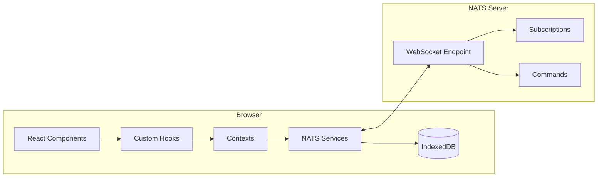
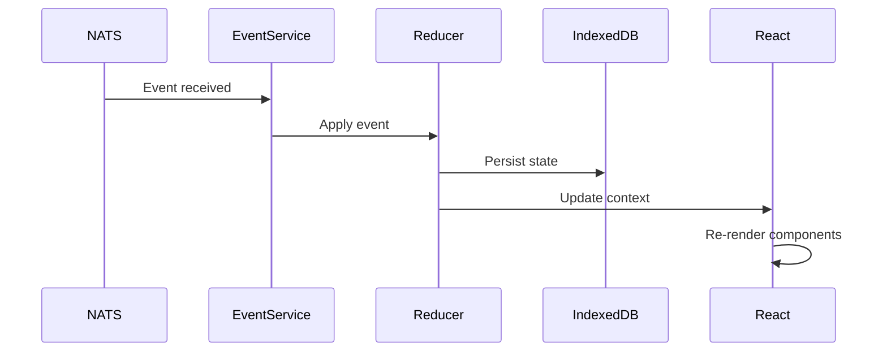
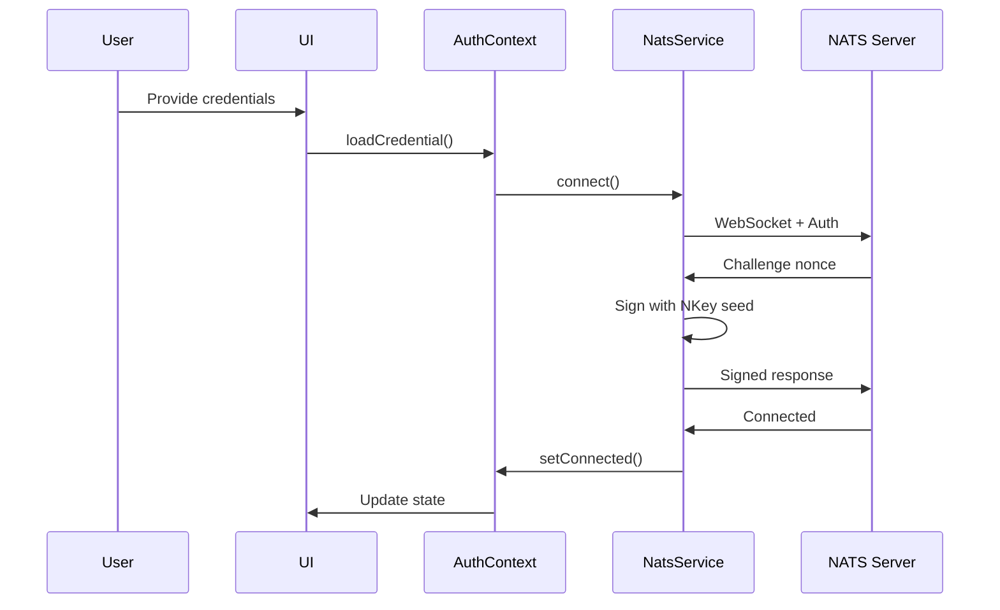

# Quickstart: Developer Documentation Implementation

**Feature**: 001-developer-docs
**Date**: 2026-01-20

## Overview

This quickstart provides implementation guidance for creating the developer documentation. Follow these steps to create high-quality documentation that meets all functional requirements and success criteria.

---

## Prerequisites

Before implementing:
1. Review `research.md` for complete API inventory
2. Review `data-model.md` for documentation structure specifications
3. Have access to the existing codebase at `react/src/`

---

## Implementation Steps

### Step 1: Create Directory Structure

```bash
mkdir -p docs/concepts docs/best-practices
touch docs/README.md
touch docs/architecture.md
touch docs/getting-started.md
touch docs/project-structure.md
touch docs/quick-reference.md
touch docs/troubleshooting.md
touch docs/migration-tips.md
touch docs/concepts/nats-fundamentals.md
touch docs/concepts/authentication.md
touch docs/concepts/state-management.md
touch docs/best-practices/security.md
touch docs/best-practices/error-handling.md
touch docs/best-practices/state-management.md
touch docs/best-practices/testing.md
```

### Step 2: Create docs/README.md (FR-001)

**Purpose**: Entry point that explains what the template is and who it's for.

**Structure**:
```markdown
# NATS UI Template

Brief tagline about building real-time web UIs with NATS.

## What is this template?

2-3 paragraphs covering:
- Purpose: Build browser apps that communicate exclusively via NATS
- Value: Real-time reactivity, offline support, type-safe patterns
- Approach: Event-driven architecture with React

## Key Features

Bullet list:
- Direct NATS WebSocket connectivity
- Secure credential handling (encrypted storage)
- Event-driven state management
- Offline support with IndexedDB
- Cross-tab synchronization
- Type-safe commands and events

## Target Audience

- Developers building NATS-native web applications
- Teams migrating from REST to event-driven architecture
- AI agents generating code for NATS-based UIs

## Prerequisites

Link to getting-started.md prerequisites section.

## Documentation Structure

Table of contents with descriptions:
| Document | Description |
|----------|-------------|
| Getting Started | Setup guide |
| ... | ... |
```

### Step 3: Create docs/architecture.md (FR-001, FR-010)

**Required Mermaid Diagrams**:

1. **System Architecture**:


2. **Event-Driven State Flow**:


3. **Authentication Sequence**:


### Step 4: Create docs/concepts/ Files (FR-002)

**nats-fundamentals.md** should cover:
- What NATS is (messaging system, not database)
- Pub/sub with simple example
- Request/reply with example
- Subject naming conventions
- WebSocket transport for browsers

**authentication.md** should cover:
- Overview of auth in NATS-native apps
- Credential file format (.creds)
- Username/password authentication
- How NKey challenge-response works (conceptually)
- Credential storage encryption

**state-management.md** should cover:
- Why event-driven (not REST)
- Event types and their payloads
- How the reducer works
- Optimistic updates pattern
- Offline support with IndexedDB

### Step 5: Create docs/getting-started.md (FR-003)

**Critical**: Must be completable in 30 minutes (SC-002).

**Sections**:
1. Prerequisites (Node.js 20.x, npm, Git)
2. Clone repository
3. Install dependencies
4. Configure environment (.env.example → .env)
5. Start NATS server (Docker one-liner)
6. Run development server
7. Verify setup (what to expect)

**Include Docker command**:
```bash
docker run -d --name nats -p 4222:4222 -p 8222:8222 nats:latest -js
```

**Include .env example**:
```
VITE_NATS_URL=ws://localhost:4222
```

### Step 6: Create docs/project-structure.md (FR-007)

Use tree format with inline descriptions:
```
react/
├── src/
│   ├── components/     # UI components (presentational + container)
│   ├── contexts/       # React contexts for global state
│   ├── hooks/          # Custom React hooks
│   ├── pages/          # Route-level page components
│   ├── services/       # NATS and storage services
│   │   ├── nats/       # NATS connection, events, commands
│   │   ├── state/      # IndexedDB, reducer, sync
│   │   └── credentials/# Credential parsing and encryption
│   ├── types/          # TypeScript type definitions
│   └── utils/          # Utility functions
└── tests/              # Test files mirroring src/
```

### Step 7: Create docs/best-practices/ Files (FR-004)

**security.md**:
- Never log credentials
- Use WSS in production
- CSP header configuration
- Input sanitization for subjects

**error-handling.md**:
- Connection error codes and handling
- Command error handling
- User-friendly error messages
- Retry strategies

**state-management.md**:
- Optimistic update pattern with rollback
- Stale data detection
- Cross-tab sync best practices
- Performance (avoid unnecessary re-renders)

**testing.md**:
- Test structure recommendations
- Mocking NatsService
- Testing hooks with providers
- Integration test patterns

### Step 8: Create docs/quick-reference.md (FR-006)

**Format**: Tables and code blocks for quick lookup.

**Hooks Section**:
```markdown
## Hooks

### useAuth
```tsx
const {
  isAuthenticated,
  authenticateWithFile,
  disconnect
} = useAuth();
```

### useAppState
```tsx
const { user, notifications, refreshState } = useAppState();
```
```

**Include**:
- All 7 hooks with signatures
- All 3 contexts with exposed values
- Core type definitions
- Event types table
- Command types table
- NATS subject patterns

### Step 9: Create docs/troubleshooting.md (FR-008)

**Format**: Problem → Cause → Solution.

**Must Cover (SC-006: top 5 errors)**:
1. "Connection refused" - NATS server not running
2. "Authentication failed" - Invalid credentials
3. "State not updating" - Missing event subscription
4. "WebSocket error" - Wrong URL or protocol (ws vs wss)
5. "Credential parse error" - Invalid .creds file format

### Step 10: Create docs/migration-tips.md (FR-011)

**Incremental adoption guide**:
1. Add NATS connection alongside existing REST
2. Start with read-only subscriptions
3. Convert one endpoint at a time
4. Add credential management
5. Implement event-driven state

---

## Code Example Guidelines

### Runnable Examples (SC-003: 90% runnable)

Every example should:
1. Include necessary imports
2. Use obvious placeholder values (`YOUR_SERVER_URL`)
3. Be syntactically correct TypeScript/TSX
4. Work when pasted into the template project

**Good Example**:
```tsx
import { useAuth } from '../hooks/useAuth';

function LoginButton() {
  const { authenticateWithFile, isLoading } = useAuth();

  const handleFileSelect = async (file: File) => {
    const success = await authenticateWithFile(
      file,
      'ws://localhost:4222' // Replace with your NATS server URL
    );
    if (success) {
      console.log('Connected!');
    }
  };

  return (
    <input
      type="file"
      accept=".creds"
      onChange={(e) => e.target.files?.[0] && handleFileSelect(e.target.files[0])}
      disabled={isLoading}
    />
  );
}
```

**Bad Example** (missing imports, incomplete):
```tsx
// Don't do this:
const { authenticateWithFile } = useAuth();
authenticateWithFile(file, url);
```

---

## AI Agent Optimization (FR-005, SC-005)

For AI agents to generate correct code 80% of the time:

1. **Explicit Type Definitions**: Include full type signatures, not just usage
2. **Complete Imports**: Always show import paths
3. **Error Handling**: Include try/catch in examples
4. **Pattern Names**: Use consistent terminology (e.g., "command pattern", "event subscription")
5. **Cross-References**: Link related concepts

---

## Validation Checklist

Before marking documentation complete:

- [ ] All 14 documentation files exist
- [ ] All FR-001 through FR-011 are addressed
- [ ] At least 4 Mermaid diagrams in architecture.md
- [ ] Getting started completable in <30 minutes (test it!)
- [ ] 90%+ of code examples are runnable
- [ ] Troubleshooting covers 5+ common errors
- [ ] Quick reference covers all hooks, contexts, types
- [ ] All cross-references resolve correctly

---

## File Checklist

| File | FR Coverage | Priority |
|------|-------------|----------|
| docs/README.md | FR-001 | P1 |
| docs/architecture.md | FR-001, FR-010 | P1 |
| docs/getting-started.md | FR-003 | P1 |
| docs/concepts/nats-fundamentals.md | FR-002 | P1 |
| docs/concepts/authentication.md | FR-002 | P1 |
| docs/concepts/state-management.md | FR-002 | P2 |
| docs/project-structure.md | FR-007 | P2 |
| docs/best-practices/security.md | FR-004 | P2 |
| docs/best-practices/error-handling.md | FR-004 | P2 |
| docs/best-practices/state-management.md | FR-004 | P3 |
| docs/best-practices/testing.md | FR-004 | P3 |
| docs/quick-reference.md | FR-006 | P2 |
| docs/troubleshooting.md | FR-008 | P2 |
| docs/migration-tips.md | FR-011 | P3 |
